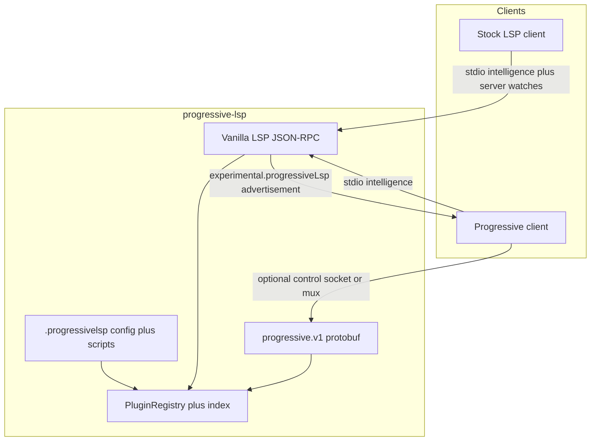
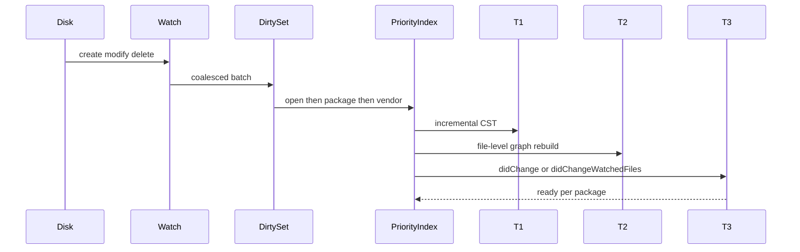

# Architecture

Process and crate boundaries. Types: [detailed-design.md](detailed-design.md). Patterns: [design-patterns.md](design-patterns.md).

## Product boundary

**This product owns:** parse, index, resolve, watch-for-reindex, FilesSince, engine packs, vanilla LSP, `progressive.v1`, `.progressivelsp`, host scripts, install/verify of *itself*.

**A consumer owns:** spawn, how bytes reach the host, editor UI, git, terminals, IDE settings.

**Client tiers**

| Tier | Transport | What works |
|---|---|---|
| Stock LSP | stdio JSON-RPC | Intelligence + server-side `notify` + `.progressivelsp` files |
| Progressive | stdio LSP + control socket or `--mux` | Stock plus FilesSince, WatchBatch, live config/packs/scripts, TierReady |

## Processes



**Core** is one static binary: vanilla LSP, optional control, `PluginRegistry`, Tree-sitter, T1/T2, watch/index/FilesSince, Rhai, engine supervisor, `install`/`serve`.

**Engines** are optional sibling binaries (or a small static PHP+phpactor tree) in `engines/`. The core never requires them to boot. Opening Java must not pull clangd. Opening PHP must not pull clangd.

## Crate graph

```text
progressive-lsp/                 bin: serve + install, register_builtins
  progressive-lsp-protocol       LSP Facade, JSON-RPC, experimental caps
  progressive-lsp-control        proto + codec   (consumers MAY depend)
  progressive-lsp-plugin         PluginRegistry + public traits
  progressive-lsp-script         Rhai ScriptHost
  progressive-lsp-install        probe, packs, hash, ArtifactTransport  (consumers MAY depend)
  progressive-lsp-watch
  progressive-lsp-index
  progressive-lsp-resolve
  progressive-lsp-workspace
  progressive-lsp-engine         EngineAdapter impls + supervisor
  progressive-lsp-core           ids, errors, ClockPort, LanguageVersion, prefix
  progressive-lsp-lang-*         one crate per language, LanguageFactory
```

**Dependency rule:** stock editors depend on nothing from this repo. Progressive consumers may depend on `progressive-lsp-install` and `progressive-lsp-control`. `progressive-lsp-plugin` is for people compiling *this* binary.

## On-disk surface (`.progressivelsp`)

Directory name is **`.progressivelsp`** (no hyphen).

```text
$HOME/.progressivelsp/                 # default prefix; never a git tree
  bin/progressive-lsp
  engines/
  cache/                               # index; content-addressed
  log/
  run/control.sock                     # protobuf control (optional)
  config.toml                          # user global
  scripts/                             # user Rhai
  workspaces/<path-id>/                # hashed absolute path
    config.toml
    scripts/

<workspace>/.progressivelsp/           # OPTIONAL project overlay
  config.toml                          # may be committed
  scripts/                             # may be committed
  .gitignore                           # belt: ignore cache/run/log
```

**Merge chain (later file wins for keys it sets):** `$PREFIX/config.toml` (user global) → `$PREFIX/workspaces/<id>/config.toml` → `<workspace>/.progressivelsp/config.toml` (project overlay). Same order as [detailed-design.md](detailed-design.md). `initialize` `initializationOptions` may override the documented subset (scripts, packs, prefix) for the session.

**Git:** bins, cache, logs, sockets only under `$HOME/.progressivelsp/`. If the server creates anything under the worktree overlay besides shareable config/scripts, it appends those paths to **`.git/info/exclude`** and keeps the belt `.gitignore`. It never edits the project’s committed `.gitignore`.

`--prefix` / `PROGRESSIVE_LSP_HOME` relocates the home dir. Overlay **name** stays `.progressivelsp` so a repo can carry config without knowing the prefix.

## Resolver chain and ingest

Try T3 if that language’s engine is ready for the file’s package; else T2; else T1. Never block the client on ingestion. Every location includes `data.tier` (`syntax` | `graph` | `types`) when we attach `data`.



**Watch order of preference**

1. `textDocument/didChange` for open buffers.
2. Stock: server `notify`. Client `didChangeWatchedFiles` is optional; coalesce.
3. Progressive: `WatchBatch` (do not force a second inotify if the client already watches). Catch-up is `FilesSince` on protobuf, never on JSON-RPC.

**Fast re-index**

- Per-file generation + content hash. Unchanged files are not re-parsed.
- Incremental Tree-sitter `InputEdit` on every keystroke; T2 for that file debounced (~50–100 ms).
- T2/T3 rebuild is file- and package-scoped.
- Priority: open buffers > recently viewed > same package > other packages > vendor/deps.
- Content-addressed disk cache (grammar version + language-id + file hash) under user cache, never inside the git worktree.
- Stock clients: `workDoneProgress`. Progressive: also `TierReady`.

**Ignore globs (defaults):** `node_modules` internals, `.git/objects`, vendor object stores, `zig-cache` / `.zig-cache`, module download caches. **Still watch manifests:** `Cargo.toml`, `pom.xml`, `composer.json`, `tsconfig.json`, `compile_commands.json`, `*.csproj`, `go.mod`, `go.work`, `build.zig`, `build.zig.zon`.

## Plugins

`PluginRegistry` is the composition-time Factory. Kinds: `LanguageFactory`, `WorkspaceSource`, `EngineAdapter`, `WatchFilter`, `ScriptEngineFactory`. Link-time registration (`inventory` or `register_builtins()`). Feature flags: `--features lang-php`. No `dlopen`. See [plugin-sdk.md](plugin-sdk.md).

## Control plane

Optional. Canonical encoding: protobuf, length-prefixed `u32be` + payload. Default `serve`: LSP on stdio, control off. `--control-socket` / `--control-fd` / `--mux`. Spec: [control-protocol.md](control-protocol.md).

## Build and dist

`cargo xtask` only. musl default; `xtask dist --libc musl|glibc-static --dest DIR` writes per-triple tarballs + SHA256 + `manifest.json`. Darwin `xtask dist` payloads are stubs (not musl ELFs; not `check-static` greens). Linux CI publishes the real `x86_64-unknown-linux-musl` / `aarch64-unknown-linux-musl` tarballs. Engine packs are **cached, content-addressed jobs** keyed by upstream git SHA in pack manifests (independent of core crate **0.1.0**). PR CI does not compile LLVM. Allocator: `xtask bench-alloc` → `xtask/allocator-matrix.toml`; `dist` only reads that file ([testing.md](testing.md)).

Host platforms for **this** server: Linux fully static x86_64 and aarch64. Darwin/Windows clients may speak LSP to a remote Linux static binary; native macOS/Windows hosts are post-v1.
