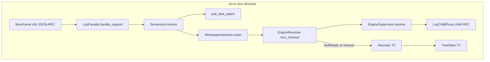
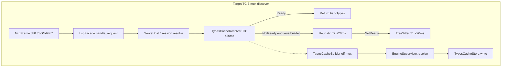

# Design pattern audit report

**Status:** Complete (TC-1.1 / TC-1.2).  
**Spike:** [design-pattern-audit.md](../spikes/design-pattern-audit.md)  
**Normative:** [design-patterns.md](../design-patterns.md), [types-cache/design.md](design.md), [types-cache/requirements.md](requirements.md)  
**Human ack (2026-09-14):** Meta-orchestrator proceeds with P0 list for TC-4 unless a row is ambiguous.

| Field | Value |
|-------|--------|
| Spike agent | TCACHE-1 / TC-1 design pattern audit |
| Completed | 2026-09-14 |
| Scope | All workspace members in root `Cargo.toml` + excluded `integration/harness` |
| Rust sources changed | None (docs only) |
| Lang crate boundaries | Not proposed for refactor |

**Counts:** 27 workspace crates + 1 excluded harness crate; **160** `src/**/*.rs` module rows (157 workspace + 3 harness); **6 P0** items for TC-4 / cutover.

---

## 1. Executive summary

- Interactive discover today is **T3 `EngineResolver` first**, then heuristic T2, then Tree-sitter T1. That is the inverse of FR-1.1 (T3′ → T2 → T1) and violates FR-1.4 once T3′ is the product path.
- `EngineResolver` uses **request-path `recv_timeout`** (`400 ms` definition/implementation/typeDefinition, **`8 s` references**) as UX. This is the REQ-NFR-1.3 anti-pattern named in the addendum and ADR 001.
- `WorkspaceSession::attach_supervisor` **prepends** a single `EngineResolver` (java constructor + `with_file_language`) onto the session chain. `ServeHost::with_supervisor` does the same. There is **no** `TypesCache*` crate or chain step yet (expected; addendum types are planned for TC-2).
- `didOpen` already does the right *shape*: index `open_buffer` + `index_text`, then `EngineSupervisor::forward_did_open` → pack inbox / `LspChildProxy::schedule_warm` off the mux thread. Builder gating should reuse this **opened set**, not invent a second didOpen.
- `ServeHost::resolve` wraps `session.resolve` and calls **`poll_disk_watch()`** (workspace source walk + metadata) on every discover. That is extra mux-thread work and can blow the 20 ms liveness budget even before T3 RPC.
- Discover WAL extras include `resolve_ms`, `tier`, `location_count` but **not** `cache_state` (REQ-NFR-3.1). Session tests only assert the key exists, not a bound.
- Language id from path is **copied** in `session.indexer_for`, `session.resolve` extras, and `engine::resolve::language_from_file` (ts vs javascript diverge). Cache keys will fork unless TC-4.3 consolidates this.
- POC IDE `DiscoverCommand` / `LspIoRequest::Discover` is a **Command + mailbox**; UI does not re-implement resolve. Container mux is `MuxStdio` channel 0 JSON-RPC. No duplicate T3 chain in the IDE.
- Control `IndexStatus` / `TierReady` already have Facade + Port + Observer shapes. `sync_types_tier_from_engines` promotes Graph → Types when the supervisor is ready — that is **engine readiness**, not T3′ cache ready (FR-6.1 later).
- `progressive-lsp-lang-*` crates follow Abstract Factory + Visitor; **out of TC-4 scope** (REQ-NFR-4.3).
- Most named types already map to [design-patterns.md](../design-patterns.md). Gaps are listed in §5 (code types without a table row; addendum types not in code).
- TC-5 has **no** unit or harness assertion that a chain step or mux discover is ≤ 20 ms. Harness records `elapsed_ms` / deadlines of **seconds**.
- Target after TC-3: mux chain is `TypesCacheResolver` → T2 → T1; `EngineSupervisor::resolve` is **builder-only**; delete request-path try budgets.

---

## 2. Crate inventory

Workspace members from root `Cargo.toml`. `integration/harness` is **excluded** (`exclude = ["integration/harness"]`). `xtask` and `poc-ide` **are** members.

| Crate | Role (1 line) | Composition root? |
|-------|---------------|-------------------|
| `progressive-lsp` | Serve + install bin; wires prefix, supervisor, `ServeHost`, mux/socket | **Y** (`src/main.rs` / `run_serve`) |
| `progressive-lsp-core` | IDs, config, clock, log ports, URI codec, domain errors | N |
| `progressive-lsp-plugin` | `PluginRegistry` + `LanguageFactory` | N |
| `progressive-lsp-protocol` | JSON-RPC `LspFacade`, framing, mux frames | N |
| `progressive-lsp-control` | Envelope RPCs, `ControlServer`, proto DTOs | N |
| `progressive-lsp-install` | Pack install plan/apply, selectors, transports | N |
| `progressive-lsp-watch` | Coalescer, journal, watch backends/filters | N |
| `progressive-lsp-index` | `IndexService`, dirty/priority/cache, ingest | N |
| `progressive-lsp-resolve` | Query types, chain, T1/T2 resolvers | N |
| `progressive-lsp-workspace` | Disk adapters → `WorkspaceModel` | N |
| `progressive-lsp-script` | Rhai `ScriptHost` + engine factory | N |
| `progressive-lsp-engine` | Supervisor, pack adapter, `EngineResolver`, LSP child | N |
| `progressive-lsp-lang-java` | Java factory, indexer, tokens, heuristics | N — **do not refactor boundary** |
| `progressive-lsp-lang-php` | PHP factory + indexer | N — gated |
| `progressive-lsp-lang-html` | HTML factory + indexer | N — gated |
| `progressive-lsp-lang-css` | CSS factory + indexer | N — gated |
| `progressive-lsp-lang-javascript` | JS factory + indexer | N — gated |
| `progressive-lsp-lang-go` | Go factory + indexer | N — gated |
| `progressive-lsp-lang-zig` | Zig factory + indexer | N — gated |
| `progressive-lsp-lang-python` | Python factory + indexer | N — gated |
| `progressive-lsp-lang-rust` | Rust factory, indexer, `RustT1Resolver` | N — gated |
| `progressive-lsp-lang-c` | C factory + indexer | N — gated |
| `progressive-lsp-lang-cpp` | C++ factory + indexer | N — gated |
| `progressive-lsp-lang-csharp` | C# factory + indexer (T1/T2 ceiling) | N — gated |
| `progressive-lsp-log` | WAL Actor, adapters, `LogOpenPlan` | N |
| `xtask` | Operator CLI: musl/pack/runtime/freshness | **Y** (`xtask/src/main.rs`) |
| `poc-ide` | In-tree editor consumer sample | **Y** (`poc-ide/src/main.rs`) |
| `integration/harness` (`plsp-it1`) | Integration drivers (IT-1/2/3, discover-container) | **Y** (non-member bin) |

Bins: `progressive-lsp` (`src/main.rs`); `poc-ide`; `xtask`; harness `plsp-it1`. No `progressive-lsp-types-cache` member yet (TC-2).

---

## 3. Module table

Priority: **P0** = blocks TCACHE / must be in TC-4.1 (or TC-3 cutover listed here so TC-4 can assign). **P1** = do during TC-4. **P2** = defer. **OK** = named pattern, no TCACHE-blocking smell.

### 3.1 `progressive-lsp` (composition root)

| Path | Primary types | Pattern | Ad-hoc flags | Suggested pattern | Priority |
|------|---------------|---------|--------------|-------------------|----------|
| `src/main.rs` | (thin `main` → `run`) | Composition root | None | — | OK |
| `src/lib.rs` | `Command`, `ServeOpts`, `InstallOpts`, `CliError`; `run_serve`, `serve_with_io_and_log`, `build_registry` | Composition root | CLI DTOs not in design-patterns table; wires all `PackAdapter`s | Value objects for CLI (optional row) | P2 |
| `src/serve_host.rs` | `ServeHost`, `ServeDiskWatch`; `root_from_params` | Facade; Observer+Adapter; Adapter | `resolve` duplicates session `LogScope` + **`poll_disk_watch` on every discover**; `sync_types_tier_from_engines` is engine-ready, not cache-ready; `collect_sources` duplicated with session | Thin Facade: discover → `LspIntelligence` only; watch on observer tick | **P0** |
| `src/session.rs` | `WorkspaceSession`; `register_languages`; `ghost_reindex_unopened` | Facade | **Prepends `EngineResolver`**; god mix (indexers, ingest, tokens, resolve, scripts); **triplicate ext→lang**; WAL missing `cache_state`; `resolve` wall clock is whole chain including T3 | Facade compose chain; `LanguageCatalog`/`LanguageId` helper in core; generation Port for T3′ | **P0** |
| `src/control_socket.rs` | `bind_control_socket`, `spawn_control_accept` | Adapter | 80/500 ms stream timeouts are I/O, not discover UX | — | OK |

### 3.2 `progressive-lsp-core`

| Path | Primary types | Pattern | Ad-hoc flags | Suggested | Priority |
|------|---------------|---------|--------------|-----------|----------|
| `src/lib.rs` | re-exports | — | — | — | OK |
| `src/ids.rs` | `LanguageId`, `PackageId`, `FileId`, `WorkspaceId`, `Tier`, `LanguageVersion` | Identity / value object | — | — | OK |
| `src/file_uri.rs` | `path_to_file_uri` / `path_from_file_uri` | Adapter | — | — | OK |
| `src/config.rs` | `Config`, `ConfigOverlay`, `ConfigLoad`, `T2Backend`, `T2Table` | Chain/Builder; value object | — | — | OK |
| `src/prefix.rs` | `PrefixLayout` | Scoped Singleton | — | — | OK |
| `src/clock.rs` | `ClockPort`, `SystemClock`, `FakeClock` | Port / test double | — | — | OK |
| `src/error.rs` | typed domain errors | Domain Result | — | — | OK |
| `src/log.rs` | `LogPort`, `LogRecord`, `LogScope`, `LevelFilter`, `FakeLog`, … | Port / Facade pieces / DTO | — | — | OK |
| `src/git_exclude.rs` | `GitExcludeReport`; `apply_worktree_excludes` | Command | — | — | OK |
| `src/rss.rs` | `sample_rss_bytes` | Value object | — | — | OK |

### 3.3 `progressive-lsp-plugin`

| Path | Primary types | Pattern | Ad-hoc | Suggested | Priority |
|------|---------------|---------|--------|-----------|----------|
| `src/lib.rs` | `PluginRegistry`, `LanguageFactory` | Registry; Abstract Factory | Root `build_registry` is the live factory graph | — | OK |

### 3.4 `progressive-lsp-protocol`

| Path | Primary types | Pattern | Ad-hoc | Suggested | Priority |
|------|---------------|---------|--------|-----------|----------|
| `src/lib.rs` | `LspFacade`, `ProgressiveLspCap` | Facade; DTO | Mux loop is in Facade (acceptable) | — | OK |
| `src/intelligence.rs` | `LspIntelligence` | Port | — | — | OK |
| `src/rpc.rs` | `JsonRpcRequest`, `JsonRpcError` | Adapter / DTO | **Not in design-patterns table** | DTO / Adapter row | P2 |
| `src/framing.rs` | `FramingError`; `encode`/`decode` | Adapter | FramingError unnamed in table | Domain Result row | P2 |
| `src/mux.rs` | `MuxFrame`, `MuxError` | Adapter | MuxError unnamed | Domain Result row | P2 |
| `src/progress.rs` | `WorkDoneProgress`, `ProgressKind` | Event / DTO | Duplicate name vs index ingest progress | Keep; document alias | P2 |

### 3.5 `progressive-lsp-control`

| Path | Primary types | Pattern | Ad-hoc | Suggested | Priority |
|------|---------------|---------|--------|-----------|----------|
| `src/lib.rs` | re-exports | — | — | — | OK |
| `src/service.rs` | `ControlServer`, `ControlPlane`, `FilesSincePort` | Facade; Port | Default plane without host → IndexStatus `not_started` (documented) | Optional `TypesCacheReady` Observer later (FR-6.1) | OK |
| `src/messages.rs` | `Envelope`, `IndexStatus*`, `TierReady`, `WatchBatch`, `IngestState`, … | DTO / public dispatch | — | — | OK |
| `src/codec.rs` | `CodecError`, `DecodeOutcome` | Adapter | **Not in table** | Domain Result / value object | P2 |

### 3.6 `progressive-lsp-install`

| Path | Primary types | Pattern | Ad-hoc | Suggested | Priority |
|------|---------------|---------|--------|-----------|----------|
| `src/lib.rs` | `Installer`, `InstallPlan` | Builder + Command | — | — | OK |
| `src/manifest.rs` | `Manifest`, `ManifestArtifact` | Schema / DTO | — | — | OK |
| `src/dist_manifest.rs` | `DistManifest`, `DistArtifact` | Schema / DTO | — | — | OK |
| `src/selector.rs` | `PackSelector`, `ExplicitPacks`, `CensusSelector`, `PackId` | Strategy | — | — | OK |
| `src/probe.rs` | `HostProbe`, `BuildCensus` | Value objects | — | — | OK |
| `src/transport.rs` | `ArtifactTransport`, `LocalFs`, `FakeTransport`, `FakeRemoteTransport` | Strategy / doubles | — | — | OK |
| `src/hash.rs` | `sha256`, `sha256_file` | (functions) | No type | Keep as Installer helpers | OK |

### 3.7 `progressive-lsp-watch`

| Path | Primary types | Pattern | Ad-hoc | Suggested | Priority |
|------|---------------|---------|--------|-----------|----------|
| `src/lib.rs` | `WatchEvent`, `WatchBatch` (watch crate) | Event / DTO | Name collision with control `WatchBatch` | Document dual DTO | P2 |
| `src/coalescer.rs` | `WatchCoalescer`, `SharedCoalescer` | Observer + Scheduler; Port | — | — | OK |
| `src/backend.rs` | `WatchBackend`, `NotifyWatcher`, `FakeWatcher`, `WatchKind`, `RawWatchEvent` | Port / Adapter | Kind/raw not in table | Value object rows | P2 |
| `src/filter.rs` | `WatchFilter`, `IdentityWatchFilter`, `DefaultIgnoreFilter`, `DenyListFilter` | Decorator | — | — | OK |
| `src/journal.rs` | `FilesSinceJournal`, `FilesSinceAnswer`, `FilesSinceQuery` | Repository + DTO | `FilesSinceQuery` not in table | DTO row | P2 |

### 3.8 `progressive-lsp-index`

| Path | Primary types | Pattern | Ad-hoc | Suggested | Priority |
|------|---------------|---------|--------|-----------|----------|
| `src/lib.rs` | `SymbolIndex` impl glue | Adapter (`SharedIndex`) | — | — | OK |
| `src/service.rs` | `IndexService`, `SharedIndex`, `LanguageIndexer`, `IndexedFile`, `InputChange` | Facade; Visitor port; value objects | **Generation lives here** but no `CacheGeneration` Port for T3′ | Expose generation Port (TC-2.6) | **P0** (port, not god-split) |
| `src/dirty.rs` | `DirtySet` | Command queue | — | — | OK |
| `src/priority.rs` | `PriorityIndex`, `IndexClass` | Priority queue | `IndexClass` not in table | Value object | P2 |
| `src/cache.rs` | `IndexCache`, `CacheKey` | Repository; identity | T1 extract cache ≠ T3′ (do not rename to “the cache”) | — | OK |
| `src/ingest.rs` | `PackageIngest`, `IngestReport`, `WorkDoneProgress`, `ProgressKind` | Command; Event | — | — | OK |

### 3.9 `progressive-lsp-resolve`

| Path | Primary types | Pattern | Ad-hoc | Suggested | Priority |
|------|---------------|---------|--------|-----------|----------|
| `src/lib.rs` | `Resolver` | Chain step trait | — | — | OK |
| `src/chain.rs` | `ResolverChain` | Chain of Responsibility | No per-step liveness; empty chain → `Ready([])` Syntax | Optional budget decorator (TC-5.6) | P1 |
| `src/query.rs` | `ResolveQuery`, `QueryKind`, `ResolveResult`, `LspLocation`, `ResolveOutcome`, … | Query / Command | — | — | OK |
| `src/tree_sitter.rs` | `TreeSitterResolver`, `SymbolIndex`, `IndexedSymbol` | Chain step; Port | — | — | OK |
| `src/heuristic.rs` | `HeuristicResolver` | Strategy | — | — | OK |
| `src/t2.rs` | `T2Strategy` | Strategy factory | — | — | OK |
| `src/stack_graph.rs` | `StackGraphResolver`, `TsgPin`, `TsgLoadState` | Strategy; value objects | — | — | OK |
| `src/graph.rs` | `GraphIndex`, `GraphFacts`, `TypeEdge`, … | Port; value objects | T2 graph ≠ T3′ relation graph (design: keep separate v1) | — | OK |
| `src/fake.rs` | `FakeResolver`, `NotReadyResolver` | Test double | — | — | OK |
| `src/tsg_runtime.rs` | `query` / `query_with_tsg` | Adapter (feature) | Function module | — | OK |

**Tests:** chain tests assert first-Ready / NotReady fallthrough. **No elapsed / 20 ms asserts.**

### 3.10 `progressive-lsp-workspace`

| Path | Primary types | Pattern | Ad-hoc | Suggested | Priority |
|------|---------------|---------|--------|-----------|----------|
| `src/lib.rs` | `detect_workspace` | — | — | — | OK |
| `src/model.rs` | `WorkspaceModel`, `WorkspaceSource`, `PackageEntry` | Domain model; Adapter trait | `PackageEntry` not in table | DTO row | P2 |
| `src/directory.rs` | `DirectoryAdapter` | Adapter | — | — | OK |
| `src/maven.rs` | `MavenAdapter` | Adapter | — | — | OK |
| `src/gradle.rs` | `GradleAdapter` | Adapter | — | — | OK |
| `src/eclipse.rs` | `EclipseAdapter` | Adapter | — | — | OK |
| `src/composer.rs` | `ComposerAdapter` | Adapter | — | — | OK |
| `src/go_mod.rs` | `GoModAdapter` | Adapter | — | — | OK |
| `src/zig_build.rs` | `ZigBuildAdapter` | Adapter | — | — | OK |
| `src/pyproject.rs` | `PyprojectAdapter` | Adapter | — | — | OK |
| `src/cargo.rs` | `CargoTomlAdapter` | Adapter | — | — | OK |
| `src/compile_commands.rs` | `CompileCommandsAdapter`, `CompileCommand` | Adapter | `CompileCommand` not in table | DTO | P2 |
| `src/csproj.rs` | `CsprojAdapter` | Adapter | — | — | OK |

### 3.11 `progressive-lsp-script`

| Path | Primary types | Pattern | Ad-hoc | Suggested | Priority |
|------|---------------|---------|--------|-----------|----------|
| `src/lib.rs` | re-exports | — | — | — | OK |
| `src/host.rs` | `ScriptHost`, `HookName`, `ScriptContext`, `ScriptDecision`, `SpawnTweak`, `SpawnDecision` | Interpreter + Sandbox; Command/DTO | — | — | OK |
| `src/engine.rs` | `ScriptEngine`, `ScriptEngineFactory`, `RhaiEngineFactory`, `FakeEngine`, `FakeEngineFactory` | Abstract Factory; doubles | — | — | OK |

### 3.12 `progressive-lsp-engine`

| Path | Primary types | Pattern | Ad-hoc | Suggested | Priority |
|------|---------------|---------|--------|-----------|----------|
| `src/lib.rs` | re-exports | — | — | — | OK |
| `src/adapter.rs` | `EngineAdapter`, `EngineBinary`, `SpawnCtx`, `ChildHandle`, `ChildIo`, `SpawnPlan`, `SpawnPort`, … | Adapter; Ports; value objects | — | — | OK |
| `src/supervisor.rs` | `EngineSupervisor` | Supervisor | `resolve` is sync child RPC (correct for **builder**, wrong on mux) | Builder-only after TC-3 | **P0** (call site, not type) |
| `src/resolve.rs` | `EngineResolver` | Adapter / Chain step | **On mux chain**; `ENGINE_*_TRY_BUDGET` timeout UX; `language_from_file` fork | Remove from chain; keep type for builder tests or delete from request path | **P0** |
| `src/lsp_child.rs` | `LspChildProxy`, `LspChildError` | Adapter (child LSP) | **Types not in design-patterns**; `resolve_query` blocks on child when warmed | Document; builder-only `resolve_query` | **P0** (usage) / P1 (table row) |
| `src/pack.rs` | `PackAdapter` | Adapter | Inbox `forward_did_open` (good) | — | OK |
| `src/discovery.rs` | `discover_pack`, pack name helpers | Repository + Strategy helpers | — | — | OK |
| `src/fake.rs` | `FakeEngineAdapter`, `FakeAnswers` | Test double | — | — | OK |
| `src/hooks.rs` | `EngineHooks`, `NoopHooks`, `ScriptHookBridge`, `AbortSpawnHooks` | Port / Adapter | `AbortSpawnHooks` not named in table | Test double row | P2 |
| `src/backoff.rs` | `BackoffPolicy` | Strategy | — | — | OK |
| `src/capabilities.rs` | `EngineCapabilities` | Value object | — | — | OK |

### 3.13 `progressive-lsp-lang-*` (human-gated; no TC-4 boundary change)

Same pattern family: **Abstract Factory** + **Visitor/Strategy indexer**. Audit only.

| Crate / path | Primary types | Pattern | Priority |
|--------------|---------------|---------|----------|
| `lang-java/src/lib.rs` | re-exports | — | OK |
| `lang-java/src/factory.rs` | `JavaLanguageFactory` | Abstract Factory | OK |
| `lang-java/src/extract.rs` | `JavaIndexer` | Visitor + Strategy | OK |
| `lang-java/src/tokens.rs` | `SemanticTokensLegend`, `SemanticToken` | DTO (not in table) | P2 |
| `lang-java/src/heuristic.rs`, `f12.rs`, `bakeoff.rs` | helpers | Ad-hoc test/eval | P2 |
| `lang-php` … `lang-csharp` `src/lib.rs` | `*Indexer`, `*LanguageFactory` (+ `RustT1Resolver` on rust) | Factory + Visitor (+ Decorator on rust) | OK |

Do **not** fold T3′ population into these crates (REQ-NFR-4.3). Language-specific graph population is a later builder policy, not a lang-crate merge.

### 3.14 `progressive-lsp-log`

| Path | Primary types | Pattern | Priority |
|------|---------------|---------|----------|
| `src/lib.rs` | re-exports | — | OK |
| `src/repository.rs` | `SqliteLogRepository` | Adapter / Repository | OK |
| `src/actor.rs` | `WriterActor` | Actor | OK |
| `src/batch.rs` | `CrashSafeBatch` | Unit of Work | OK |
| `src/path.rs` | `ServeLogPath` | Value object | OK |
| `src/open_plan.rs` | `LogOpenPlan` | Command | OK |
| `src/reentrancy.rs` | `ReentrancyGuard` | Proxy / Guard | OK |
| `src/bridges.rs` | `LogCrateBridge`, `TracingBridge` | Adapter | OK |
| `src/child_stderr.rs` | `ChildStderrAdapter`, `FakeChildStderr` | Observer + Adapter | OK |
| `src/log_file_tail.rs` | `LogFileTailAdapter` | Adapter | OK |
| `src/lsp_message.rs` | `LspLogMessageAdapter` | Adapter | OK |
| `src/config_warn.rs` | `ConfigWarnAdapter` | Adapter | OK |
| `src/cli_usage.rs` | `CliUsageAdapter` | Adapter | OK |
| `src/stderr_emit.rs` | `StderrEmitAdapter` | Adapter | OK |
| `src/stdio_adapters.rs` | `NullStderrAdapter`, `InheritStderrAdapter` | Adapter | OK |

### 3.15 `xtask` (operator CLI)

| Path | Primary types | Pattern | Priority |
|------|---------------|---------|----------|
| `src/main.rs` | composition | Composition root | OK |
| `src/cli.rs` | `XtaskCommand`, `HelpTopic`, `LspArch`, `LspFlavor`, `LspFlags`, `BuildTarget`, `BuildFlags`, `RunLaunch` | Value objects | OK |
| `src/poc.rs` | `PocArgs` | Value object | OK |
| `src/freshness.rs` | `LspArtifact`, `LspArtifactStamp`, `Freshness` | Value objects | OK |
| `src/pack.rs` | `PackPin`, `PackKind`, `PackBuildPlan`, toolchains, `CacheAction` | Value objects / Command | OK |
| `src/musl.rs` | `MuslBuildPlan`, `DockerPort`, `CommandDockerPort`, `RecordingDockerPort` | Value object; Port | OK |
| `src/runtime_image.rs` | `RuntimeImagePlan`, `PackImageCopy` | Value objects | OK |
| `src/artifact_store.rs` | `StoreManifest`, `StoreArtifact`, `ArtifactFormat`, `ByteFetcher`, `NetworkFetcher` | Schema; Port | OK |
| `src/check_static.rs` | `StaticCheckPolicy`, `StaticLinkError` | Strategy; Domain Result | OK |
| `src/allocator.rs`, `perf.rs`, `smoke.rs`, `dist.rs`, `tarball.rs` | CLI helpers | Ad-hoc operator | P2 |

### 3.16 `poc-ide`

| Path | Primary types | Pattern | Ad-hoc | Suggested | Priority |
|------|---------------|---------|--------|-----------|----------|
| `src/main.rs` | bin wire | Composition root | — | — | OK |
| `src/lib.rs` | module tree | — | — | — | OK |
| `src/discover.rs` | `DiscoverKind`, `DiscoverCommand`, `DiscoverApplyPlan`, `PendingDiscover` | Command; value | **`DiscoverApplyPlan` not in table**; `apply` blocking path is tests-only | Add row; keep `to_io_request` as prod | P1 |
| `src/lsp_io.rs` | `LspIoRequest`, `LspIoEvent`, mailbox, `DiscoverFlight`, `LspIoAttach` | Command queue + Event | Records `duration_ms` on flight, **no ≤20 ms test** | — | P1 (tests TC-5) |
| `src/lsp.rs` | `LspClient`, `StdioLsp`, `ServeSpawn`, `ProgressiveLspCap` | Facade; Adapter | Stock JSON-RPC only (correct) | — | OK |
| `src/mux.rs` | `MuxStdio`, `MuxLsp`, `MuxControl` | Adapter | Control wait uses condvar timeout (not discover UX) | — | OK |
| `src/control.rs` | `ControlClient`, `ControlAttach`, `ControlPush`, `ControlIoHandle` | Adapter; Observer | — | — | OK |
| `src/tier.rs` | `PackageTierMap`, `TierStrip`, `DiscoverMenu`, `EngineSnap`, `ReadinessLine` | Value objects | **`EngineSnap`, `ReadinessLine` not in table** | Add rows | P2 |
| `src/references.rs` | `ReferencesModal` | Value / UI command | **Not in table** | Command / value | P2 |
| `src/ports.rs` | Fs/Dialog/Lsp/Control/Watch/Clock Ports + fakes | Ports / doubles | — | — | OK |
| `src/language.rs` | `LanguageCatalog`, `ServeMode`, `DiscoverOffer`, `WireTier`, `ControlSocketPath` | Registry; Strategy | — | — | OK |
| `src/runtime.rs` | `DockerRuntime`, `LaunchJournal`, `DockerRunPlan`, … | Port / Adapter | — | — | OK |
| `src/runtime_io.rs` | Runtime mailbox | Command + Event | — | — | OK |
| `src/tree.rs` / `tree_io.rs` | `FileTree`, expand mailbox | Composite; Command | — | — | OK |
| `src/tabs.rs`, `buffer.rs`, `edit.rs`, `highlight.rs`, `layout.rs` | editor domain | Identity / Command / Cache | — | — | OK |
| `src/watch.rs`, `conflict.rs` | `DiskWatch`, `ConflictModal` | Observer; Command | — | — | OK |
| `src/log.rs`, `proof.rs`, `child_stderr.rs` | `RunLog`, `ProofStatus` | Repository; DTO | Discover rows have timing, no `cache_state` | Align REQ-NFR-3 when serve emits it | P1 |
| `src/console.rs` | `ProtocolConsole` | Facade | — | — | OK |
| `src/open_mode.rs` | `OpenMode`, `HostOs`, `LaunchFlags` | Strategy | — | — | OK |
| `src/error.rs` | `IdeError` | Domain Result | — | — | OK |
| `src/ui.rs` | `PocIdeApp`, `RfdDialog`, `ArboardClipboard` | Composition + Adapters | egui surface | — | OK |

**Discover:** Navigate → `PendingDiscover` / `DiscoverCommand::to_io_request` → `LspIoMailbox` → `LspClient::{definition,implementation,references}` → mux/stdio. **No local resolve chain.** Satisfies “no duplicate resolve” (FR hygiene). UI must not wait on builder (FR-6.2) — mailbox already off UI thread.

### 3.17 `integration/harness` (non-member)

| Path | Primary types | Pattern | Ad-hoc | Suggested | Priority |
|------|---------------|---------|--------|-----------|----------|
| `src/main.rs` | IT-1/2 drivers, `It2*` | Adapter / DTO | Long recv deadlines | — | OK (integration) |
| `src/progressive.rs` | `ProgressiveOpts`, IT-3 | Adapter | — | — | OK |
| `src/discover_container.rs` | `DiscoverContainerOpts` | Adapter | **Not in table**; `elapsed_ms` in JSON, **no p99 ≤ 20 ms**; discover deadline default **15 s** | `ItDiscoverDriver` + TC-5.4 golden | **P1** (TC-5, not TC-4 code) |

---

## 4. Cross-cutting flows

### 4.1 Mux discover (`textDocument/definition` \| `implementation` \| `references`)

**As-is hops** (container / `--mux`):

1. POC IDE or harness `MuxLsp` / harness `write_mux_frame` — channel 0 opaque JSON-RPC (`poc-ide/src/mux.rs`, `integration/harness/src/discover_container.rs`).
2. `LspFacade::serve_mux` (`progressive-lsp-protocol/src/lib.rs`) reads `MuxFrame`; LSP channel → `dispatch_json_rpc_mux` → `handle_request`.
3. `handle_request` matches method → `dispatch_intelligence` builds `ResolveQuery` (`QueryKind` + `FileId` from URI + `Position`).
4. `LspIntelligence::resolve` on **`ServeHost`** (`src/serve_host.rs`): `LogScope`; for discover kinds calls `session.resolve` then **`poll_disk_watch()`**.
5. `WorkspaceSession::resolve` (`src/session.rs`): `Instant` start; **`self.chain.resolve(q)`**; WAL info extras (`resolve_ms`, `tier`, `location_count`, … **no `cache_state`**).
6. `ResolverChain` (`progressive-lsp-resolve/src/chain.rs`): first `Ready` wins.
7. **First step:** `EngineResolver` (`progressive-lsp-engine/src/resolve.rs`) if supervisor attached: `is_ready` + `engine_session_warmed`; else skip. If warm: **spawn thread + `recv_timeout(400ms|8s)`** → `EngineSupervisor::resolve`.
8. Supervisor → `EngineAdapter::resolve_query` → `PackAdapter` → `LspChildProxy::resolve_query` (drain inbox, require URI in **opened** set, child JSON-RPC).
9. On `NotReady` / timeout: T2 `HeuristicResolver` / `StackGraphResolver`, then T1 `TreeSitterResolver`.
10. `after_lsp` hook: `poll_disk_watch` + `ControlServer::drain_pushes` (WatchBatch / TierReady) on channel 1.

**FR-1.4 / REQ-NFR-4:** **Violated today** — live T3 RPC is on the mux request path. Timeout-as-UX **violates REQ-NFR-1.3**.

### 4.2 `didOpen` → index + engine inbox + warm

1. `LspFacade::handle_request` `"textDocument/didOpen"` → `intel.did_open(uri, lang, text)`.
2. `ServeHost::did_open` → `WorkspaceSession::did_open`.
3. Session: `path_from_file_uri` → `index.open_buffer` → `indexer_for` + `index_text` (T1/T2 extract).
4. `EngineSupervisor::forward_did_open` → each child’s `PackAdapter::forward_did_open` queues `EngineMessage` on `ChildHandle` inbox (unit test: mux does not block on javacs).
5. `LspChildProxy::schedule_warm` (named thread `plsp-warm-*`): initialize + `drain_inbox` so opened set is populated **off** the mux thread.
6. Until `is_warmed()`, `EngineResolver` returns `NotReady` (`skip_unwarmed`) → T2/T1. Matches REQ-NFR-2.1 (first click may be T2/T1).
7. Workspace ingest (`ingest_workspace`) is **package stream**, not per-didOpen; `didChange` must not wait on remaining packages (`PackageIngest` invariant).

**Builder rule (design.md):** reuse opened-set / inbox-drain; never empty didOpen on builder path. **Already encoded in `lsp_child`.** Wire T3′ builder to the same gate (TC-3.3).

### 4.3 Control: `IndexStatus`, `TierReady`, watch batch

1. Mux channel 1 or Unix `bind_control_socket` → `ControlServer::dispatch_envelope` / `handle_mux_payload_with_pushes`.
2. `IndexStatus` → `ControlPlane` (`ServeHost::index_status`): `sync_types_tier_from_engines`, package rows + `ingest_state` + engine rows from supervisor.
3. `TierStatus` → session `package_tier`.
4. After LSP or on control dispatch: `drain_pushes` emits `WatchBatch` (`take_watch_batches`) and `TierReady` (`take_tier_ready`).
5. `TierReady` queued when ingest marks Graph and/or `sync_types_tier_from_engines` sees supervisor ready → `mark_package_tier(Types)`.
6. Watch: `poll_disk_watch` diffs snapshot, filters, journals, `apply_disk_path`; if subscribed, queues `WatchBatch`.
7. POC IDE: `ControlIoHandle` polls `IndexStatus` / `TierStatus` / `ControlPush`; `PackageTierMap` + `DiscoverMenu` enable items. **Does not resolve.**

**FR-6.1:** no `TypesCacheReady` yet. Current `TierReady` means **engine/package tier**, not query-cache generation.

### 4.4 POC IDE `DiscoverCommand` → mux

1. `DiscoverMenu` / F12 → `PendingDiscover` or `DiscoverCommand`.
2. `to_io_request` → `LspIoRequest::Discover` (no `LspTransport::request` on UI).
3. IO thread `pump` / worker → `LspClient` method → `MuxLsp` or `StdioLsp`.
4. `DiscoverFlight` second-begin no-op; `apply_locations` jumps / `ReferencesModal`.
5. `RunLog::log_discover` (path, uri, line, character, location_count, optional `duration_ms`).

**No duplicate resolve.** Residual risk: `DiscoverCommand::apply` still calls transport synchronously (FakeLsp tests). Prod UI path is mailbox.

---

## 5. P0 refactor list (assign TC-4.1+)

Human can assign TC-4.1 from this table without re-reading the repo.

| ID | Path | Issue | Target pattern | Suggested WP |
|----|------|-------|----------------|--------------|
| P0-1 | `progressive-lsp-engine/src/resolve.rs` | `EngineResolver` on mux chain; `recv_timeout` 400 ms / 8 s as UX (FR-1.4, REQ-NFR-1.3) | Chain step **removed** from request path; engine resolve is builder Adapter only | **TC-3.2 + TC-3.5**; TC-4.1 verifies no leftover prepend |
| P0-2 | `src/session.rs` `attach_supervisor` | Prepends `EngineResolver` as first chain step | `WorkspaceSession` Facade composes **T3′ → T2 → T1**; supervisor held for builder, not chain | **TC-3.2 / TC-4.2** |
| P0-3 | `src/serve_host.rs` `LspIntelligence::resolve` | Discover path runs `poll_disk_watch` (FS walk) on mux thread; duplicate LogScope vs session | Facade: resolve only; watch via Observer tick / after_lsp, not inside discover | **TC-4.2** |
| P0-4 | `src/session.rs` `resolve` extras | No `cache_state` ∈ {hit, miss, stale, n/a} (REQ-NFR-3.1) | WAL DTO extras on discover `LogRecord` | **TC-3.4** (listed so TC-4 does not invent a second logger) |
| P0-5 | `src/session.rs` + `engine/src/resolve.rs` | Duplicate ext→`LanguageId` (and `ts` vs `javascript` mismatch) | Single Adapter / catalog helper (core or protocol) used by cache key + indexer + engine | **TC-4.3** |
| P0-6 | `progressive-lsp-index/src/service.rs` | No injected **generation Port** for T3′ invalidation (FR-4.1) | Port on `IndexService` / `DirtySet` generation; `InvalidationPolicy` consumes it | **TC-2.6** (crate) + **TC-4.2** (session wiring) |

**None found?** No — P0 is non-empty.

P1 (during TC-4, not cutover-blocking): `ResolverChain` optional liveness decorator; name `LspChildProxy` / `DiscoverApplyPlan` / `ReferencesModal` in design-patterns; RunLog `cache_state`; harness timing golden (TC-5.4).  
P2: CLI DTOs, codec/RPC error rows, lang-java bakeoff, xtask operator helpers, watch/control `WatchBatch` name collision.

---

## 6. `design-patterns.md` gaps

### 6.1 Types in code without a table row

Add rows (or fold into an existing row) before/with the PR that treats them as “major”:

| Type | Home | Suggested pattern |
|------|------|-------------------|
| `LspChildProxy`, `LspChildError` | `progressive-lsp-engine/src/lsp_child.rs` | Adapter + Domain Result |
| `DiscoverApplyPlan` | `poc-ide/src/discover.rs` | Value object / Command result |
| `ReferencesModal` | `poc-ide/src/references.rs` | Command / value |
| `EngineSnap`, `ReadinessLine` | `poc-ide/src/tier.rs` | Value object |
| `Command`, `ServeOpts`, `InstallOpts`, `CliError` | `src/lib.rs` | DTO / Domain Result |
| `JsonRpcRequest`, `JsonRpcError` | `protocol/rpc.rs` | DTO |
| `FramingError`, `MuxError`, `CodecError`, `DecodeOutcome` | protocol / control | Domain Result / value |
| `FilesSinceQuery` | watch journal | DTO |
| `WatchKind`, `RawWatchEvent` | watch backend | Value object / Event |
| `IndexClass`, `InputChange` | index | Value object |
| `PackageEntry`, `CompileCommand` | workspace | DTO |
| `AbortSpawnHooks` | engine hooks | Test double |
| `SemanticTokensLegend`, `SemanticToken` | lang-java tokens | DTO |
| `DiscoverContainerOpts` | integration/harness | Adapter / DTO (integration-only, like `It3ProgressiveDriver`) |

### 6.2 Table rows without code (planned TCACHE)

From [design-patterns-addendum.md](design-patterns-addendum.md) — **do not implement until TC-2**:

`TypesCacheStore`, `TypesCacheKey`, `TypesCacheEntry`, `CacheGeneration`, `TypesCacheResolver`, `TypesCacheBuilder`, `BuilderQueue`, `InvalidationPolicy`, `TypesCachePort`, `FakeTypesCacheStore`, `RecordingBuilder`.

Merge addendum into the main table when those types land (TC-2.7).

### 6.3 Anti-patterns observed (addendum)

- `EngineResolver` on mux chain — **present**.
- Request-path `recv_timeout` > 20 ms — **present** (400 ms / 8 s).
- T1/T2 labeled as “the cache” in code — **not** found in these paths; index `IndexCache` is extract memo, correctly separate.
- Discover logic duplicated in serve / poc-ide / engine — **resolve is not duplicated in IDE**; **language-id and discover logging are duplicated** on the server.

---

## 7. Timing / test surface (TC-5)

| Location | What exists | Gap for TC-5 |
|----------|-------------|--------------|
| `progressive-lsp-resolve/src/chain.rs` tests | First-Ready, NotReady fallthrough, empty list terminal | **No** wall-time / FakeClock budget; add `TypesCacheResolver` + T2 + T1 each ≤ 20 ms on small fixtures (TC-5.6) |
| `src/session.rs` tests | `resolve_hit_emits_discover_timing_info` asserts `resolve_ms` **key exists** | No upper bound; no `cache_state`; no miss→hit second resolve |
| `progressive-lsp-engine/src/resolve.rs` tests | Ready / skip-once / file language | **No** test that timeout path is gone after TC-3.5; today timeout is the product |
| `integration/harness/src/discover_container.rs` | Trace `elapsed_ms`; `--discover-deadline-ms` (default 15 s); golden locations | **No** `resolve_ms` p99 ≤ 20 ms; no second-click cache hit (TC-3.6 / TC-5.4) |
| `poc-ide` `lsp_io` / `mux` | `DiscoverFlight` duration; mux condvar; FakeLsp pumps | **No** assert IO-thread discover wait ≤ 20 ms (and should not: client waits on **server**). Assert UI `poll` never blocks; optional RunLog `cache_state` |
| Serve WAL | extras: `resolve_ms`, `tier`, `location_count` | Add `cache_state`; integration trace must assert columns (REQ-NFR-3.3) |

Harness deadlines (init 600 s, discover 15 s) stay as **process** timeouts. TC-5.4 must read **mux-path** `resolve_ms` from WAL/trace, not the docker wall clock.

---

## 8. Discover path: as-is vs target (TC-3)

---

## 9. TC-1 checklist (for parent to apply)

In `docs/types-cache/implementation-checklist.md` Phase TC-1:

- [x] TC-1.1 Run design-pattern-audit spike — this file
- [x] TC-1.2 Publish `pattern-audit-report.md` — every workspace crate listed; modules mapped
- [x] TC-1.3 Prioritize P0/P1/P2 — §5
- [x] TC-1.4 design-patterns.md gap list — §6 (appendix here; do not edit `design-patterns.md` in this spike)

---

## 10. Notes for TC-2 / TC-4 agents

- New crate `progressive-lsp-types-cache` (REQ-NFR-4.2); do not sprinkle store logic into `serve_host`.
- Do not change `progressive-lsp-lang-*` crate boundaries.
- Keep `EngineResolver` type until builder calls `EngineSupervisor::resolve` directly; then delete request-path budgets.
- `PriorityIndex` / focused buffer already exist for builder warm order (design.md).
- Composition root remains `progressive-lsp` bin; session/host stay Facades, not a new Manager.
