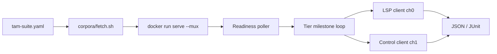

# Tier API Matrix (IT-TAM) — integration framework plan

**Status:** TAM-2 landed (`tam-run`, `FetchTrace`, meta on discover-container). **POC language:** Java.  
**Goal:** In a **real runtime container**, load a **pinned git corpus**, wait until each intelligence tier is available, and **exercise every supported public API** with **non-zero** results at **T1 (syntax)**, **T2 (graph)**, and **T3 (types)** — driven by **YAML** configs, not Rust-only golden tables.

**Related:** [integration/README.md](../README.md), [integ-seams-plan.md](integ-seams-plan.md) (**SEAMS** — chain limits, response meta, `FetchTrace`), [progressive-lsp-apis.md](../../docs/progressive-lsp-apis.md), [02-lsp-backends.md](../02-lsp-backends.md), [corpora/pins.json](../corpora/pins.json), `harness/run-discover-container.sh`, **`harness/run-tam.sh`**.

### discover-container meta / trace (TAM-2)

| Flag | Effect |
|------|--------|
| `--emit-result-meta` | `initializationOptions.progressiveLsp.emitResultMeta` + extended definition result |
| `--emit-timing` | `emitTiming` on init and definition |
| `--fetch-trace-on-fail` / `--no-fetch-trace-on-fail` | On definition **fail**, call mux `FetchTrace` when `traceId` present; JSON `trace_dump` |

Report fields: `trace_id`, `trace_dump.trace_row_count`, capped `trace_dump.trace_rows`.

### tam-run

```bash
./integration/harness/run-tam.sh hermetic-discover-java   # default fixture
PLSP_TAM_ROOT=/path/to/junit4 ./integration/harness/run-tam.sh java-junit4
```

Hermetic suite: `suites/hermetic-discover-java.tam.yaml` (maps to `integration/fixtures/discover-java`). Docker/image missing → `result: skip` in report (exit 0 from wrapper).

---

## Problem today

| Suite | What it proves | Tier coverage |
|-------|----------------|---------------|
| IT-2 | Stock LSP on one corpus row; one “tier under test” column in markdown | Observes `data.tier` opportunistically; no matrix |
| IT-3 | Progressive control + a few discover cases | Same |
| discover-container | Definition + references in Docker mux | Single fixture; not full API × tier |

We need a **repeatable matrix**: `(language, corpus, API method, tier milestone) → pass/fail + metrics`, with **source pinned by git SHA** (or local path for dev).

---

## Framework name and layout

**Suite ID:** **IT-TAM** (Tier API Matrix).

```text
integration/
  tier-api-matrix/
    README.md                 # this plan
    schema/tam-suite.yaml     # JSON Schema for suite files (optional v1: comment-doc + serde)
    suites/
      java-junit4.tam.yaml    # POC
    expected/                 # optional sidecar globs (large location lists)
    calibrate/                # instructions + one-shot record mode output
  harness/
    src/tam/                  # NEW: loader, runner, report (or crate `plsp-tam`)
    run-tam.sh                # docker + fetch + plsp-it1 tam-run
  corpora/                    # reuse pins.json + fetch.sh
```

**Runner binary:** extend `plsp-it1` with subcommand `tam-run` (same Docker/mux plumbing as `discover-container`).

---

## YAML suite format (normative sketch)

One file = one **language × corpus** matrix. Version field for forward compatibility.

```yaml
apiVersion: progressive-lsp/tam/v1
id: java-junit4
language: java
language_id: java

server:
  # Real container — same as discover-container defaults
  docker_image: progressive-lsp-runtime:local
  platform: linux/arm64          # optional
  mount_serve_bin: null          # host musl ELF override for CI
  prefix_in_container: /opt/plsp
  packs: [javacs]                # install --packs before serve
  serve_args: [--mux, --control-socket, /tmp/plsp.sock]

source:
  git:
    url: https://github.com/junit-team/junit4.git
    sha: 05fe2a64f59127c02135be22f416e91260d6ede6
  # OR for dev:
  # local_path: ../corpora/.cache/junit4

workspace:
  root_uri: file:///workspace   # mount corpus here in container
  manifest: pom.xml             # ingest hint; must exist under root
  packages: []                  # optional: restrict package ids for TierStatus

readiness:
  # Upper bounds: poll control IndexStatus / TierStatus / TierReady / CacheReady — no sleep-for-semantics
  poll_interval_ms: 200
  init_deadline_ms: 600000
  syntax_available_within_ms: 30000    # ingest started; T1 path can answer
  graph_available_within_ms: 120000    # package tier ≥ graph
  types_available_within_ms: 300000    # engine ready + builder can fill T3′
  per_request_deadline_ms: 15000

tiers:
  # Three milestone names map to T1 / T2 / T3 observation points (not separate servers)
  milestones:
    - id: t1_syntax
      when:
        tier_status_at_least: syntax   # TierStatus row for primary package
      # optional strict isolation (phase TAM-2b):
      # tier_ceiling_env: PROGRESSIVE_LSP_TEST_TIER_CEILING=syntax

    - id: t2_graph
      when:
        tier_status_at_least: graph

    - id: t3_types
      when:
        tier_status_at_least: types
        engines_ready: [javacs]
        # optional: cache_ready_for_query: references  # wait CacheReady push

cases:
  - id: def-testcase
    file: src/main/java/junit/framework/TestCase.java
    position: { line: 42, character: 10 }   # 0-based; or anchor: { find: "TestCase" }
    apis:
      - method: textDocument/definition
        tiers: [t1_syntax, t2_graph, t3_types]
        expect:
          min_locations: 1
          tier_in: [syntax, graph, types]     # at least one loc must match milestone tier
          uri_suffix: TestCase.java           # soft: under workspace

      - method: textDocument/references
        tiers: [t2_graph, t3_types]           # T1 may be empty by policy — document per method
        expect:
          min_locations: 1

      - method: textDocument/hover
        tiers: [t1_syntax, t2_graph, t3_types]
        expect:
          non_empty: true

      - method: textDocument/documentSymbol
        tiers: [t1_syntax, t2_graph, t3_types]
        expect:
          min_symbols: 1

      - method: workspace/symbol
        tiers: [t2_graph, t3_types]
        query: TestCase
        expect:
          min_symbols: 1

      - method: textDocument/semanticTokens/full
        tiers: [t1_syntax, t2_graph, t3_types]
        expect:
          min_token_words: 1

      - method: textDocument/typeDefinition
        tiers: [t3_types]
        expect:
          min_locations: 0   # 0 allowed at T3 if language has no types for site; Java POC: ≥1

      - method: textDocument/implementation
        tiers: [t3_types]
        expect:
          min_locations: 0

  - id: ghost-assert-sibling
    file: src/main/java/junit/framework/TestCase.java
    apis:
      - method: workspace/symbol
        tiers: [t2_graph]
        query: Assert
        setup:
          ghost_edit:
            path: src/main/java/junit/framework/Assert.java
            # harness applies disk edit; then poll WatchBatch / FilesSince / re-query
        expect:
          min_symbols: 1

control_apis:
  # Same container session; mux channel 1
  - method: IndexStatus
    tiers: [t1_syntax, t2_graph, t3_types]
    expect:
      ingest_state_in: [running, done]
      min_packages: 1

  - method: TierStatus
    tiers: [t2_graph, t3_types]
    expect:
      min_rows: 1

  - method: GetConfig
    tiers: [t1_syntax]
    expect:
      status_ok: true
```

**Expected outputs:** Inline `expect` blocks (counts, tier tags, URI patterns). Large location sets → `expected_ref: expected/java-junit4/def-testcase-t3.json` sidecar (same pattern as IT-2 goldens).

**Calibration:** `tam-run --calibrate` runs serve once, records locations/hover/tokens into sidecars; human reviews diff before pinning SHA in suite YAML.

---

## Tier pinning, response metadata, timing (FAQ)

### 1. Pin a tier on an API request (“no more than T2”)?

**Planned (SEAMS-1):** per-request and session defaults **`maxTier`** and **`maxChainIter`** under `progressiveLsp` — see [integ-seams-plan.md](integ-seams-plan.md). IT-TAM sets e.g. `maxChainIter: 2`, `maxTier: graph` for deterministic T2 validation.

**Today:** not on the wire yet; milestone scheduling + WAL timing only.

### 2. Meta-information on responses (which tier)?

**Planned (SEAMS-2):** optional **`progressiveMeta`** on every LSP/control response when `emitResultMeta` is enabled — tier, `backendLanguage`, `backendVersion`, `timing`, `traceId`. See [integ-seams-plan.md](integ-seams-plan.md).

**Today — location-shaped results only:**

| Response | Tier metadata today |
|----------|-------------------|
| `definition`, `references`, `implementation`, `typeDefinition` | Each `Location` may include **`data.tier`**: `"syntax"` \| `"graph"` \| `"types"` ([lsp-contract.md](../../docs/lsp-contract.md), `location_to_json` in `progressive-lsp-protocol`). |
| `workspace/symbol` | Nested **`location.data.tier`** on each symbol entry. |
| `hover`, `documentSymbol`, `semanticTokens/full` | **No tier field** on the LSP payload today (hover is plaintext; symbols/tokens are Tree-sitter-shaped). Infer “active path” only via **serve WAL** or run at a milestone where tier is implied. |

**IT-TAM assertions:**

- Location APIs: `expect.tier_at_most: graph` **and** `expect.tier_exact: graph` when using test ceiling or milestone.
- Non-location APIs: optional **`expect.inferred_tier_from_wal`** for discover-adjacent calls, or skip strict tier tag on hover/tokens.

**Future (optional):** extend hover/symbol JSON with `data.tier` on the progressive path only — not required for v1 matrix if YAML documents the gap.

### 3. Timing on output and in `expect`

**Planned (SEAMS-2):** `progressiveMeta.timing` on the JSON-RPC result when `emitTiming` is on; IT-TAM asserts `max_resolve_ms` against that field (WAL optional cross-check).

**Today:** timing is **not** on the LSP result; discover methods log **`resolve_ms`** to WAL — harness must scrape until SEAMS lands.

**Sources (runner merges into report JSON):**

| Field | Source | Applies to |
|-------|--------|------------|
| `wall_ms` | Harness: `Instant` around send → response id | All LSP + control RPCs |
| `resolve_ms` | Serve WAL row extras (`session` discover path) | definition, references, implementation, typeDefinition |
| `tier` | WAL extras or max/`first` `Location.data.tier` | Discover + workspace/symbol |
| `cache_state` | WAL extras: `hit` \| `miss` \| `stale` \| `n/a` | Discover when T3′ participates |
| `milestone_wait_ms` | Harness: time from session start until milestone `when` satisfied | Per milestone block |

Discover logging (normative for product): `resolve_ms`, `tier`, `location_count`, `cache_state` in WAL extras ([REQ-NFR-3.1](../../docs/types-cache/requirements.md)).

**YAML `expect.timing` (add to each `apis[]` row):**

```yaml
expect:
  min_locations: 1
  tier_at_most: graph          # when using tier ceiling or milestone t2_graph
  timing:
    max_wall_ms: 500           # client-visible latency
    max_resolve_ms: 25         # serve mux path; aligns with REQ-NFR-1 (≤20ms p99 in unit CI)
    max_resolve_ms_ci: 50      # optional slack for container / javacs cold
```

**Report row (required fields):** every executed cell writes:

```json
{
  "suite": "java-junit4",
  "case": "testcase-definition-site",
  "method": "textDocument/definition",
  "milestone": "t2_graph",
  "tier_ceiling": "graph",
  "wall_ms": 12,
  "resolve_ms": 8,
  "cache_state": "n/a",
  "observed_tier": "graph",
  "result": "pass"
}
```

**Calibration:** `tam-run --calibrate` records **p50/p95 wall_ms and resolve_ms** per `(case, method, milestone)` into `calibrate/java-junit4-baseline.json`; suite YAML references `timing.baseline_ref` with multipliers (e.g. `max_wall_ms: baseline.p95 * 1.5`).

**Failure modes:** exceed `max_*` → fail row (regression or tier-ceiling bug); missing WAL row when `require_resolve_ms: true` → fail (discover path not logging).

---

## Tier strategy (T1 / T2 / T3)

Progressive discover is a **chain** (T3′ → T2 → T1). IT-TAM does **not** require three separate binaries; it requires **three observable milestones**:

| Milestone | Control signal (primary) | LSP assertion |
|-----------|---------------------------|---------------|
| **T1** | Ingest running; syntax index usable | `Location.data.tier == syntax` **or** non-empty T1-capable response (hover, tokens, documentSymbol) |
| **T2** | `TierStatus` ≥ `graph` for package | Definition/refs with `tier == graph` **or** strictly more locations than T1 snapshot |
| **T3** | Engine `ready` + optional `CacheReady` | Definition/refs with `tier == types`; **min_locations ≥ 1** for typed discover methods |

**Non-zero hit rates (product requirement):** For each `(api, tier)` row in YAML where the method is **offered** for that language at that tier ([language matrix](../../docs/design-patterns.md)), `min_*` thresholds must be **≥ 1** (or documented exception, e.g. `implementation` optional).

**Strict tier isolation (optional phase TAM-2b):** If milestone scheduling is flaky, add **test-only** env `PROGRESSIVE_LSP_TEST_TIER_CEILING=syntax|graph|types` (serve reads in `cfg(test)` or explicit `RUSTFLAGS` integration feature) so the chain cannot mask a dead tier. Human gate + ADR before non-test use.

---

## API catalog → default matrix template

From [progressive-lsp-apis.md](../../docs/progressive-lsp-apis.md):

**LSP intelligence (per case file + position):**

| Method | T1 | T2 | T3 | Notes |
|--------|----|----|-----|-------|
| `textDocument/definition` | ✓ | ✓ | ✓ | tier tag + min 1 loc |
| `textDocument/references` | optional | ✓ | ✓ | Java POC: T2+ |
| `textDocument/hover` | ✓ | ✓ | ✓ | non-empty |
| `textDocument/documentSymbol` | ✓ | ✓ | ✓ | |
| `workspace/symbol` | — | ✓ | ✓ | needs graph ingest |
| `textDocument/semanticTokens/full` | ✓ | ✓ | ✓ | |
| `textDocument/typeDefinition` | — | — | ✓ | Java typed |
| `textDocument/implementation` | — | — | ✓ | if advertised |

**Control (session-level, no position):**

| Method | Milestones |
|--------|------------|
| `GetConfig` | all |
| `IndexStatus` | all (fields strengthen by tier) |
| `TierStatus` | T2+ |
| `FilesSince` | T2+ (after generation bump) |
| `WatchSubscribe` + disk/buffer event | T2+ (ghost case) |

**Out of v1 matrix:** `InstallPacks`, `SetConfig`, `ReloadConfig`, `ReloadScripts` (mutating; separate IT), stock-only lifecycle (`shutdown` covered by runner teardown).

---

## Runner architecture



1. **Load & validate** suite YAML (serde struct + version gate).
2. **Resolve source:** `fetch.sh --id junit4` or clone at `source.git.sha` into cache dir; bind-mount into container at `/workspace`.
3. **Start container** (reuse `DiscoverContainerOpts`: image, platform, mount serve bin, WAL host path for postmortem).
4. **Initialize** LSP + control; `install --packs` inside container if `server.packs` set.
5. **For each milestone** in order: poll until `readiness.*_within_ms` or fail; run all `cases[].apis` filtered by `tiers:` list.
6. **Each API call:** build params from `file` + `position` / `anchor`; send RPC; evaluate `expect`; capture `resolve_ms`, `tier`, `cache_state` from WAL if enabled.
7. **Emit report:** rows `{suite, case, api, milestone, result, observed_tier, counts, latency_ms, notes}`.

**Clock rule:** Same as [integration/README.md](../README.md) — poll protocol/FSM with deadlines; no fixed `sleep(5)` for correctness.

---

## Java POC scope (first suite file)

| Item | Choice |
|------|--------|
| Corpus | `junit4` @ SHA from [pins.json](../corpora/pins.json) |
| Packs | `javacs` (T3) |
| Entry cases | 2–3 files: `TestCase.java`, cross-ref to `Assert.java`, one type-use site for typeDefinition |
| Container | `progressive-lsp-runtime:local` + optional `--mount-serve-bin` for CI ELF under test |
| Success | Every **offered** LSP row in template has **pass** at **t2_graph** and **t3_types**; **t1_syntax** passes for syntax-native methods |

Deliverable gate: **`./integration/harness/run-tam.sh java-junit4`** exits 0 on Linux CI with dogfood image + real javacs pack.

---

## Implementation phases

| Phase | ID | Deliverable | Depends |
|-------|-----|-------------|---------|
| **SEAMS-1…6** | Product seams | [integ-seams-plan.md](integ-seams-plan.md): `maxChainIter`/`maxTier`, `progressiveMeta`, `FetchTrace`, unit tests | SERVE-ABS stack |
| **TAM-0** | Docs + schema | This README, `apiVersion` struct in Rust, example `suites/java-junit4.tam.yaml` (no runner) | — |
| **TAM-1** | Loader + report | `tam::Suite` serde, validation errors; JSON report schema | TAM-0 |
| **TAM-2** | Container runner | `plsp-it1 tam-run`; reuse mux; meta + chain policy from SEAMS | TAM-1, **SEAMS-2+** | **done** |
| **TAM-3** | Java POC matrix | Full LSP battery + 1 ghost + control rows; calibrate → `expected/` sidecars; wired in `run-tam.sh` | TAM-2, corpora fetch |
| **TAM-4** | CI + docs | Nightly job (not every PR); row in `integration/README.md`; link from [implementation-plan.md](../../docs/implementation-plan.md) | TAM-3 green on Linux |
| **TAM-5** | Second language | Copy YAML template (e.g. Python `flask` pin + ty pack) | TAM-4 |
| **SEAMS-1…6** | See [integ-seams-plan.md](integ-seams-plan.md) | `maxChainIter` / `maxTier`, `progressiveMeta`, `FetchTrace`, unit tests | Before TAM-3 |

**Non-goals (v1):** macOS host serve matrix (container Linux only); Neovim driver; mutating control RPC fuzz; C# T3.

---

## Testing the framework itself

| Level | What |
|-------|------|
| Unit | YAML parse, `expect` matcher on fixture JSON, milestone scheduler with FakeClock + fake IndexStatus stream |
| Hermetic | `local_path: integration/fixtures/discover-java` — fast dev without Docker |
| Container | Java junit4 full matrix — authoritative |

---

## Traceability

| Requirement | Verification |
|-------------|--------------|
| Every supported LSP discover API | Row in default template + Java suite |
| T1 / T2 / T3 milestones | Three `tiers.milestones` + YAML `tiers:` filters |
| Non-zero hits | `min_locations` / `min_symbols` / `non_empty` |
| Git SHA source | `source.git` + corpora cache |
| Latency before availability | `readiness.*_within_ms` poll failures = fail |
| Real container | `run-tam.sh` docker path shared with discover-container |

---

## Open decisions (resolve in TAM-0 review)

1. **Sidecar format** for full location lists: JSON vs YAML snippet.
2. **Chain limits** — **SEAMS-1** wire `maxChainIter` / `maxTier` (supersedes test-only env idea).
3. **References at T1** — require empty vs skip row in Java YAML.
4. **Single suite file vs split** (`cases` vs `includes:`) for large corpora.
5. **Timing gates** — strict `max_resolve_ms: 25` in container vs baseline-relative only on nightly.

---

## Next step

Sign off **TAM-0** (schema + example Java YAML only), then implement **TAM-1/TAM-2** in `integration/harness` on top of **`serve-abs-4`** (or `main` after merge) so control exposes `tier_capabilities` and `CacheReady` for pollers.
